# NVIDIA stock prediction with linear regression and NumPy

As we climb the ladder of Data Science techniques there must be a place for good old linear regression. So let's try to predict stock prices of a quite demanding security - NVDA (NVIDIA stocks). It's demanding due to recent [turmoils](https://www.reuters.com/technology/chinas-deepseek-sets-off-ai-market-rout-2025-01-27/) related to the release of DeepSeekAI. During one of Data Science meetups I attended, the presenter shared that outperforming the market 56% of the time is considered a solid achievement in financial stock prediction. With that in mind, my final orange prediction plot may not look so silly after all ;)

## Data preparation / feature selection

I came up with an idea that popularity of topics related to NVIDIA could be a decend indicator of the demand of NVIDIA shares. Since the start of the AI revolution NVIDIA is widely associated with this hype, because of GPU's role in the process of ML models creation and usage. Neverthless, many people not particularly interested in AI still associate NVIDIA with high-performance graphics cards. Taking all into account I've decided to use Google Trends data as a "proxy" for mentioned topics popularity. As shown in the chart below, these topics are more or lesss correlated with NVIDIA popularity.

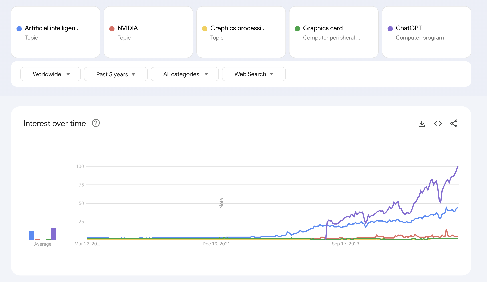

Comparing this data with actual NVDA stock prices reveals some correlation:

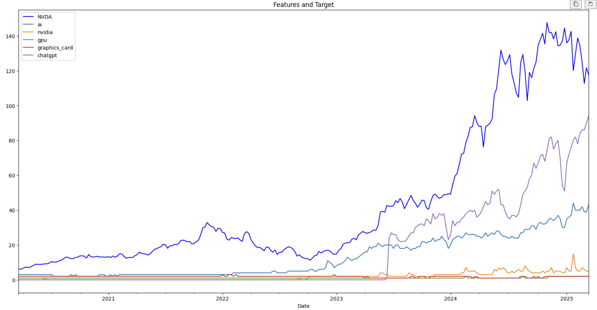

As a MLOps Engineer I try to automate as much as possible — including data preparation. I found two libraries that potentially could pull Google Trends data programmatically - [`pytrends`](https://github.com/GeneralMills/pytrends) and [`trendspy`](https://github.com/sdil87/trendspy). Unfortunately, Google seems to discourage automated scraping (which may explain the lack of an official SDK), and my automation attempts failed.

Here’s what happened with `trendspy`:

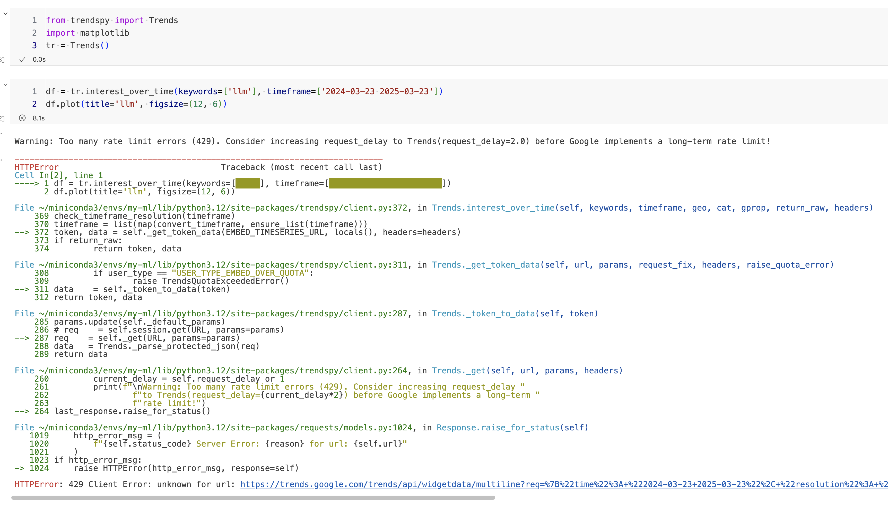

And here’s the result with `pytrends`:

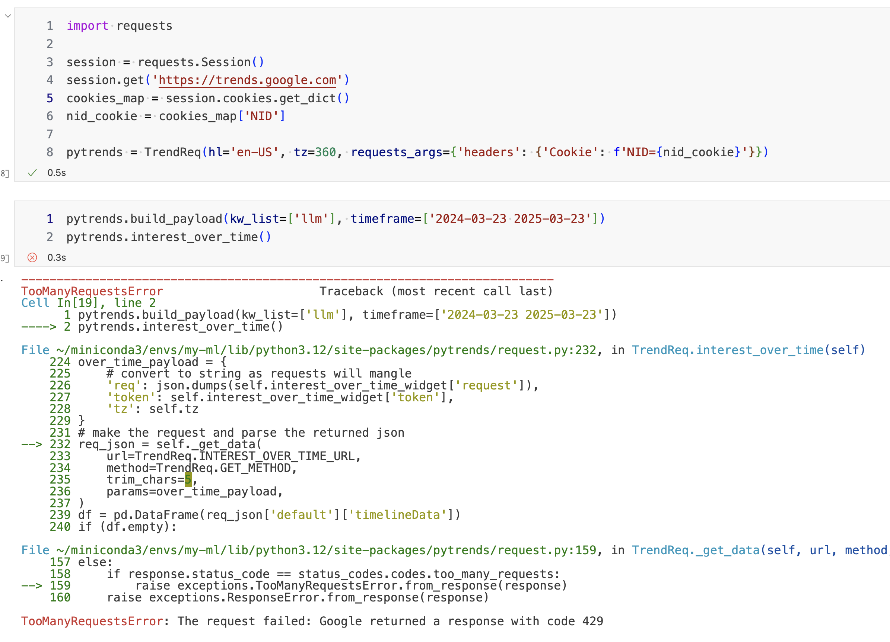

So, I had to retrieve the data manually, perform some preprocessing as shown below, and prepare it for modeling.

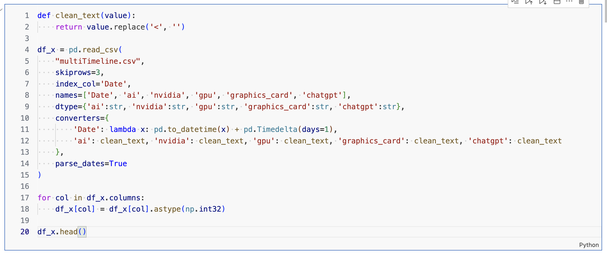

A quick look at the correlation between features shows that some of them (unsurprisingly) are highly correlated, but let's keep them and not overengineer this simple example. Interestingly, the three features most correlated with NVDA’s `Close` price are `ai`, `nvidia`, and `chatgpt` — all above 0.85.

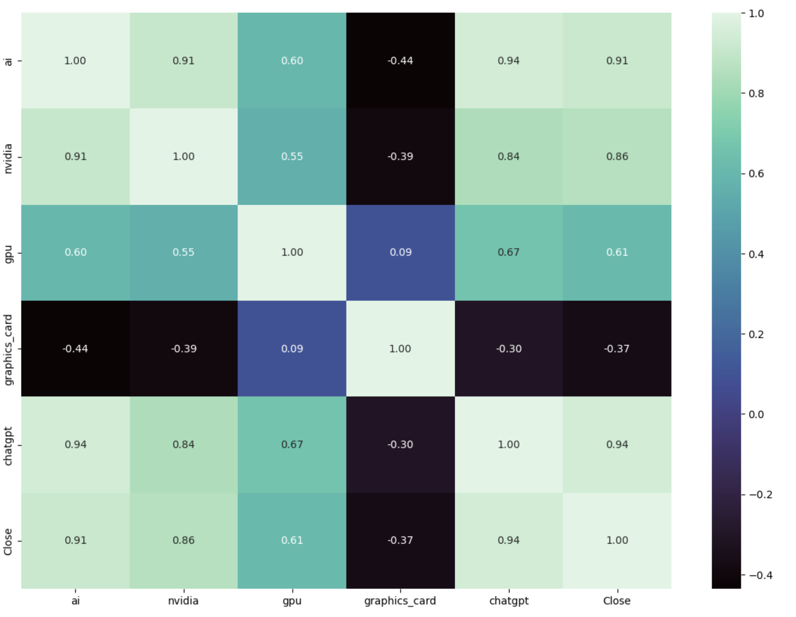

## First tuning

Based on few observations I generated an initial set of hyperparameters — specifically, the train/test split and the set of features used in the model:

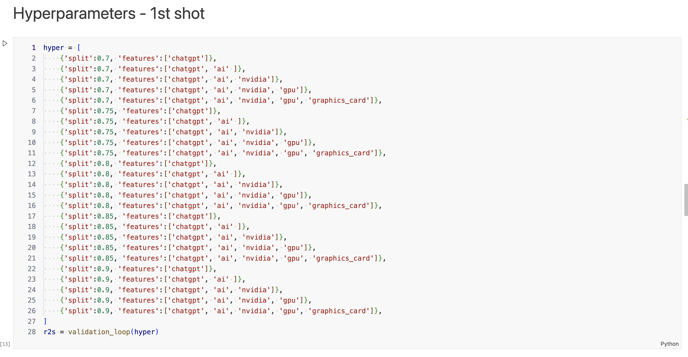

The R-squared error plotted below offers some insight into where to search for better results — smaller splits and fewer features seem promising.

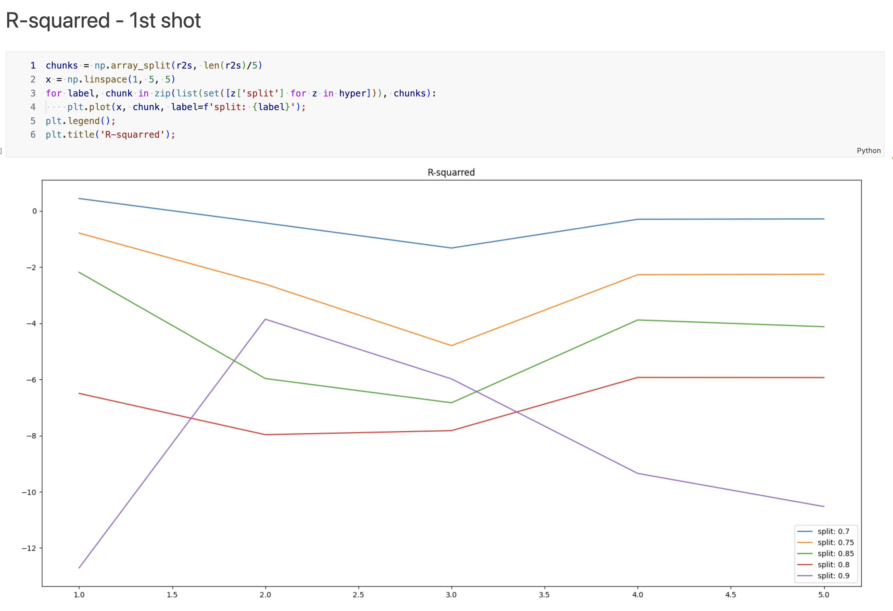

## Final tuning

Let’s generate a denser grid of hyperparameters:

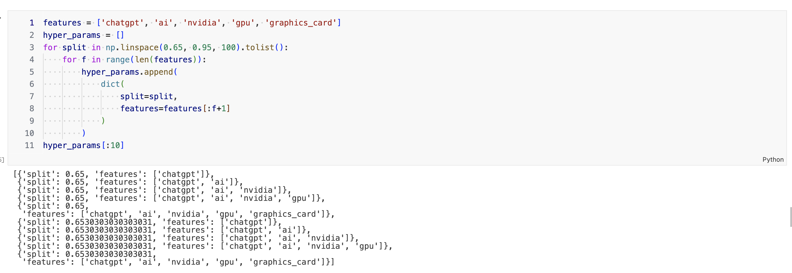

And plot a final set of extended metrics:

- for features of : `chatgpt`
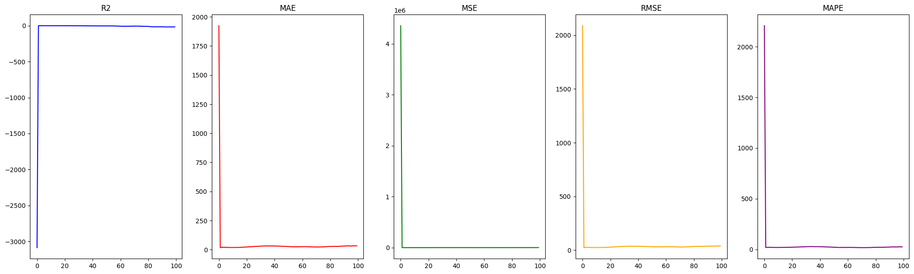

- for features of : `chatgpt`, `ai`
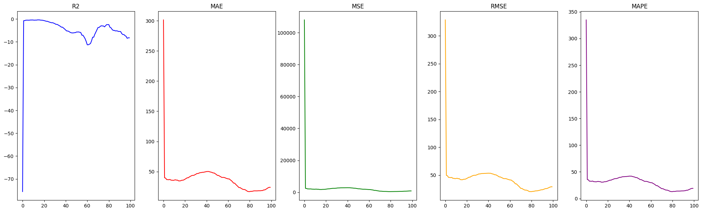

- for features of : `chatgpt`, `ai`, `nvidia`
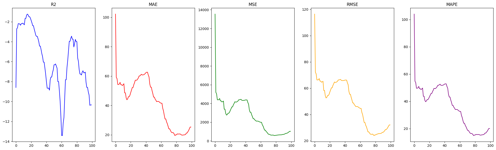

- for features of : `chatgpt`, `ai`, `nvidia`, `gpu`
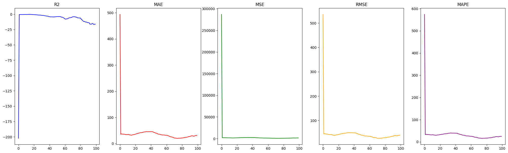

- for features of : `chatgpt`, `ai`, `nvidia`, `gpu`, `graphics_card`
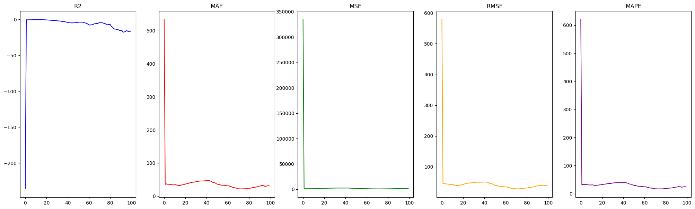

## Results and conclusions

Focusing on the R-squared metric, we can identify the top 5 values and determine the best feature set — in this case, the simplest model using only one feature (`chatgpt`) and a train/test split of 0.653.

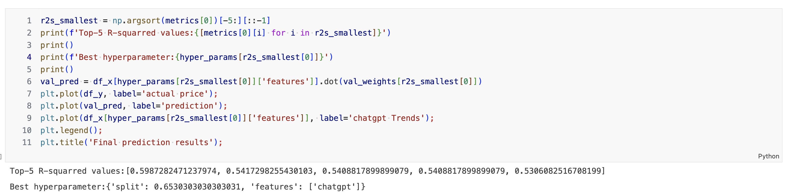

Finally, we compare the price predicted by the best model (`orange`) with the actual price (`blue`) and the Google Trends popularity of the keyword "chatgpt" (`green`).

